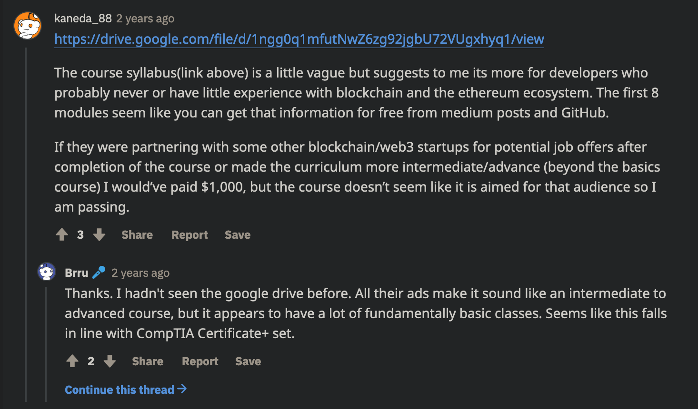

*Some thoughts from the trenches of the 2020 cohort...*

 

### Dear Reader
I graduated in late December from the 2020 ConsenSys Blockchain Developer Online Bootcamp. The course began in early September and concluded with the final project deadline on November 30 albeit generous extensions granted due to Covid. (As of writing, there are projects still being submitted and graded.) However, the route from enrollment to certificate proved treacherous and less than 15% of the class succeeded. As such, I feel obliged to warn those considering joining a future cohort, and I hope the following list will help you count the cost.

### Pros
- ***Curation***. News and information in the [cryptocosm](https://blog.blockstack.org/george-gilder-predicts-life-after-google/) is incessant, but ConsenSys expertly curates presentations, lessons, articles, and resources into a clear and cogent briefing on the state of blockchain (Ethereum) development. The mentors continued to help us grasp the insider narrative despite the surrounding buzz of Ethereum 2.0 arriving in the middle of our coursework.
  
  Here's the 2020 course sequence:
  1. Review of Blockchain Technology
  2. Blockchain Primitives
  3. Ethereum Basics
  4. Traditional and Decentralized application development
  5. Development Frameworks and Environment
  6. Solidity Fundamentals
  7. Writing Smart Contracts
  8. Ethereum and the End User
  9. Smart Contracts, Pitfalls, Testing, and Debugging
  10. Advanced Topics
  11. Additional Topics
  12. Final Project
  
  As seen in the [2018 syllabus](https://drive.google.com/file/d/1ngg0q1mfutNwZ6zg92jgbU72VUgxhyq1/view), my cohort was a rinse-and-repeat, but I learned . There were a few minor points which were outdated/deprecated (LLL and Vyper), but that's to be expected in a rapidly evolving field like Ethereum and I enjoyed brushing up on the history.
  
- ***Tech stack workflow***. [Truffle](https://www.trufflesuite.com/truffle), [Ganache](https://www.trufflesuite.com/ganache), [MetaMask](https://metamask.io/), [Infura](https://infura.io/), [Remix](https://remix.ethereum.org/#optimize=false&runs=200&evmVersion=null), [MythX](https://mythx.io/). After several mergers, the bootcamp not only offers hands-on experience with the best-in-class Ethereum tech stack, but guidance from its core developers. 
- ***[The certificate](https://courses.consensys.net/certificates/w9trgfa8fa)***.

### Cons
- ***Class size***. My cohort ballooned to a size of over 300 students before settling a little over 280. While that nets ConsenSys a breezy $250k, you can imagine the chaos on Slack.

- ***Swindling***. ConsenSys' selling point is to use its clout (["the Microsoft of crypto"](https://www.reddit.com/r/ethereum/comments/b45zov/consensys_academys_developer_bootcamp_is_back/ej4mimo?utm_source=share&utm_medium=web2x&context=3)) to back their certificates upon the successful completion of the bootcamp. There's decent buzz online as [redditors](https://www.reddit.com/r/ethdev/comments/8jwfv5/general_feeling_about_consensys_academy/) consider the cost: 
   
  
  The fine print recommended at least a year of coding experience with a full tuition refund if you dropout within the first two weeks. The course progresses gradually enough. What they fail to mention until the very end, buried in page 6 of the [final project grading rubric](https://docs.google.com/document/d/1fSiejecMogc2h7aJxIl9tfZbHRFXTipftWLevUKAmQ4/edit): 
  > **A note on project difficulty**: Depending on your current web development skill level, this project may be more or less difficult.
  
  [My final project](https://github.com/jun-sung/doge-emporium) consists of 3% Solidity and 95% JavaScript, so unless you have a good handle of JS (or know someone who does) the likelihood of passing merely with ConsenSys' Solidity lessons is astronomically low. To give you an idea of how many were rudely surprised by this: of the ~280 in my cohort, only 42 submitted their project by the deadline, and I'm guessing even fewer passed. 
  
- ***Hidden certificate***(?) While conversing with the grader of my final project, I asked if/when I needed to resolve the issues he flagged on my project repo. He replied saying that resolving the issues will enable me to get the ConsenSys certificate of proficiency apart from their certificate of completion. Meaning, there are TWO certificates though this is not mentioned anywhere in the course or in the Slack channel. I received the one for completion, but even after resolving his flagged issues within the week, he has yet to get back to me about earning the second certificate.
